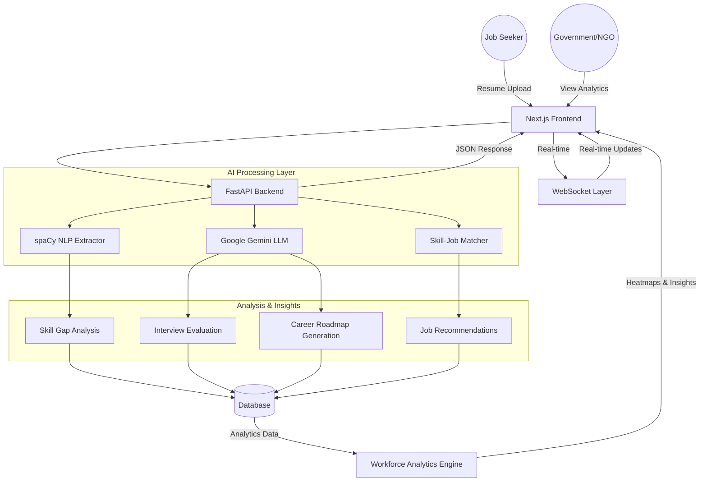

# SkillBridge AI: Career Setu 🚀

**Empowering the Future Workforce with AI-Driven Career Intelligence**

[](https://nextjs.org/)
[](https://fastapi.tiangolo.com/)
[](https://www.python.org/)
[](https://ai.google.dev/)
[](https://www.docker.com/)
[](LICENSE)

---

## 📋 Table of Contents
- [Problem Statement](#problem-statement)
- [Solution Overview](#solution-overview)
- [Key Features](#key-features)
- [Tech Stack](#tech-stack)
- [System Architecture](#system-architecture)
- [Installation & Setup](#installation--setup)
- [Usage](#usage)
- [Project Structure](#project-structure)
- [Screenshots](#screenshots)
- [Future Enhancements](#future-enhancements)
- [Contributing](#contributing)
- [License](#license)
- [Team](#team)

---

## 🎯 Problem Statement

The **"Skill-to-Job" mismatch** is a critical challenge in emerging economies:
- 🔴 **Unemployment Paradox**: Millions are jobless yet employers can't find skilled workers
- 🔴 **Unstructured Training**: Regional job seekers lack personalized, data-driven career guidance
- 🔴 **Government Blind Spots**: Policy makers have no insight into district-level skill gaps and demand patterns
- 🔴 **Manual Processes**: Traditional resume screening is slow, biased, and inefficient

**The Impact**: ~$6.7 trillion in lost economic productivity and unfulfilled human potential.

---

## 💡 Solution Overview

**SkillBridge AI** is an intelligent, end-to-end platform that bridges the gap between job seekers, training providers, and government bodies using cutting-edge AI/ML technologies:

✅ **AI-Powered Resume Intelligence** – Intelligent parsing and ATS-optimized feedback  
✅ **Personalized Career Roadmaps** – 30/60/90-day structured learning paths  
✅ **AI Interview Coach** – Real-time mock interviews with expert feedback  
✅ **Workforce Analytics** – District-level heatmaps for policy makers  
✅ **Localized Job Matching** – Region-aware job recommendations  

---

## 🌟 Key Features

### 1. 📂 Intelligent Resume Scorer (ATS 2.0)
- **Advanced NLP Parsing**: Extracts skills, experience, certifications, and contact info from unstructured documents
- **Deep Skill Analysis**: Identifies technical and soft skill proficiencies at granular levels
- **ATS Optimization**: Scores compatibility against target roles and highlights missing keywords
- **Actionable Insights**: Provides qualitative, AI-generated suggestions for improvement

### 2. 🗺️ Dynamic 30/60/90 Day Career Roadmaps
- **Personalized Learning Paths**: Automatically maps skill gaps to curated educational resources
- **Milestone-Based Progression**: Breaks down career transitions into digestible monthly goals (e.g., Clerk → Data Entry)
- **Multi-Source Integration**: Connects users with online courses, certifications, and community resources
- **Progress Tracking**: Visual dashboards to monitor learning milestones

### 3. 🎙️ AI-Powered Interview Coach
- **Role-Specific Questions**: Generates realistic interview scenarios tailored to user's target roles
- **Real-Time Analysis**: Evaluates responses on technical accuracy, confidence, and communication skills
- **Holistic Feedback**: Provides scores and personalized improvement recommendations
- **Interview History**: Tracks performance metrics over time for skill development monitoring

### 4. 📊 Workforce Analytics Dashboard (for Government & NGOs)
- **Regional Skill Heatmaps**: Visualizes supply-demand gaps at district/state levels
- **Trend Analysis**: Identifies emerging skills and declining sectors for policy decisions
- **Budget Allocation Insights**: Data-driven recommendations for training program investments
- **Decision Support Tools**: Enables strategic workforce planning and resource allocation

### 5. 🌍 Localized & Inclusive Design
- **Multi-Language Support** (Ready for expansion): Built with internationalization in mind
- **Mobile-First Responsive UI**: Works seamlessly across all devices
- **Dark Mode**: Reduces eye strain with premium visual hierarchy
- **Accessibility-First**: WCAG 2.1 compliant for inclusive user experience

---

## 🛠️ Tech Stack

### Frontend
| Component | Technology |
|-----------|-----------|
| Framework | **Next.js 14** (React with SSR/SSG) |
| Styling | **Tailwind CSS** (Utility-first design) |
| Animations | **Framer Motion** (Smooth, premium interactions) |
| UI Components | **Lucide React** (Icon library) |
| State Management | Context API / Redux (as needed) |

### Backend
| Component | Technology |
|-----------|-----------|
| Framework | **FastAPI** (Python 3.11) |
| Server | **Uvicorn** (ASGI Web Server) |
| Validation | **Pydantic** (Data validation) |
| API Documentation | Auto-generated OpenAPI/Swagger at `/docs` |

### AI & Machine Learning
| Component | Technology |
|-----------|-----------|
| NLP Engine | **spaCy** (Industrial-strength NLP) |
| Large Language Model | **Google Generative AI (Gemini)** |
| ML Algorithms | **scikit-learn** (ML utilities) |
| Data Processing | **pandas**, **NumPy** |

### Infrastructure & Deployment
| Component | Technology |
|-----------|-----------|
| Containerization | **Docker + Docker Compose** |
| Environment Management | **Python venv**, **.env configuration** |
| Version Control | **Git/GitHub** |

---

## 🏛️ System Architecture



---

## 📦 Installation & Setup

### Prerequisites
- **Node.js** 18+ and **npm** or **yarn**
- **Python** 3.11+
- **Docker** & **Docker Compose** (optional, for containerized setup)
- **Git**

### 🚀 Quick Start (Docker - Recommended)

The fastest way to get everything running in a production-like environment:

```bash
# Clone the repository
git clone https://github.com/sachinyaduvanshi553-debug/CAREER-SETU---AI.git
cd CAREER-SETU---AI

# Run with Docker Compose
docker-compose up --build
```

**Access Points:**
- 🌐 **Frontend**: http://localhost:3000
- 📚 **API Docs**: http://localhost:8000/docs (Interactive Swagger UI)
- 🔧 **API Health**: http://localhost:8000/health

---

### 🐍 Manual Setup (Developer Mode)

#### Step 1: Backend Setup

```bash
cd backend
```
# Create virtual environment
```bash
python -m venv venv
```
# Activate virtual environment
# On Windows:
venv\Scripts\activate
# On macOS/Linux:
source venv/bin/activate

# Install dependencies
```bash
pip install -r requirements.txt
```

# Download spaCy language model
```bash
python -m spacy download en_core_web_sm
```
# Set up environment variables
cp .env.example .env
# Edit .env with your Google Gemini API key and other configs

# Run the backend server
python -m uvicorn app.main:app --reload --host 0.0.0.0 --port 8000

**Backend will be available at**: `http://localhost:8000`

#### Step 2: Frontend Setup

```bash
cd ../frontend
```
# Install dependencies

```bash
npm install
```
# or
```bash
yarn install
```
# Create environment file
cp .env.example .env.local
# Update .env.local with backend API URL: NEXT_PUBLIC_API_URL=http://localhost:8000

# Run development server
```bash
npm run dev
```
# or
```bash
yarn dev
```

**Frontend will be available at**: `http://localhost:3000`

---

### ⚙️ Environment Configuration

Create a `.env` file in the `backend/` directory:

```bash
# .env.example
```
```bash
GOOGLE_API_KEY=your_google_gemini_api_key_here
```
DATABASE_URL=sqlite:///./skillbridge.db
DEBUG=True
ENVIRONMENT=development
```bash
CORS_ORIGINS=["http://localhost:3000", "http://localhost:8000"]
```

---

## 🎮 Usage

### For Job Seekers

1. **Upload & Analyze Resume**
   - Navigate to the Dashboard
   - Upload your resume (PDF, DOCX, TXT)
   - SkillBridge AI will parse and score your resume instantly

2. **Get Career Roadmap**
   - Review personalized 30/60/90-day learning paths
   - Explore curated resources for skill development
   - Track your progress with interactive dashboards

3. **Practice with AI Interview Coach**
   - Choose your target role
   - Participate in realistic mock interviews
   - Receive detailed feedback and improvement tips

4. **Discover Local Opportunities**
   - Browse region-specific job recommendations
   - Filter by skill requirements and career stage

### For Government & NGOs

1. **Access Analytics Dashboard**
   - View district-level skill supply-demand heatmaps
   - Identify emerging skill clusters
   - Monitor training program effectiveness

2. **Generate Insights Reports**
   - Export workforce data for policy planning
   - Make data-driven budget allocation decisions

---

## 📂 Project Structure

```
CAREER-SETU---AI/
│
├── backend/                      # FastAPI Python backend
│   ├── app/
│   │   ├── __init__.py
│   │   ├── main.py              # FastAPI application entry point
│   │   ├── routes/              # API endpoint definitions
│   │   ├── services/            # Business logic (NLP, LLM, matching)
│   │   ├── models/              # Pydantic models & DB schemas
│   │   └── utils/               # Helper functions
│   ├── requirements.txt          # Python dependencies
│   ├── .env.example              # Environment variables template
│   └── Dockerfile                # Docker configuration
│
├── frontend/                     # Next.js React frontend
│   ├── app/                      # Next.js app directory
│   ├── components/               # Reusable React components
│   ├── pages/                    # Page routes
│   ├── styles/                   # Tailwind & CSS modules
│   ├── public/                   # Static assets
│   ├── package.json              # Node dependencies
│   ├── next.config.js            # Next.js configuration
│   ├── tailwind.config.js        # Tailwind CSS config
│   └── .env.example              # Environment variables template
│
├── docker-compose.yml            # Multi-container orchestration
├── .gitignore                    # Git exclusion rules
├── README.md                     # Project documentation (this file)
├── TESTING.md                    # Testing & QA guidelines
├── CONTRIBUTING.md               # Contribution guidelines
├── sample_resume.txt             # Example resume for testing
└── LICENSE                       # MIT License
```

---

## 📸 Screenshots

### Dashboard & Features

<div align="center">
  <h4>Resume Analysis Interface</h4>
  
</div>

<div align="center">
  <h4>Career Roadmap Visualization</h4>
  
</div>

<div align="center">
  <h4>Interview Coach Interface</h4>
  
</div>

<div align="center">
  <h4>AI Feedback & Scoring</h4>
  
</div>

<div align="center">
  <h4>Job Recommendations</h4>
  
</div>

<div align="center">
  <h4>Analytics Dashboard</h4>
  
</div>

<div align="center">
  <h4>Skill Gap Analysis</h4>
  
</div>

<div align="center">
  <h4>User Profile & Progress</h4>
  
</div>

---

## 🔮 Future Enhancements

### Phase 2: Advanced Features
- 🌍 **Multi-Language Support**: Full i18n for regional languages (Hindi, Tamil, Telugu, etc.)
- 📱 **Mobile App**: Native React Native application for iOS & Android
- 🎥 **Video Interview Analysis**: Real-time video processing with emotion & confidence detection
- 🤖 **Advanced Skill Prediction**: ML models to predict future in-demand skills by region

### Phase 3: Enterprise & Scale
- 🏢 **Enterprise HR Integration**: APIs for HR management systems and ATS platforms
- 📊 **Advanced Analytics**: Predictive modeling for skill market trends
- 🔐 **Blockchain Credentials**: Immutable skill verification and certification records
- 🌐 **Global Expansion**: Multi-country support with localized job markets

### Phase 4: AI Enhancements
- 💬 **Conversational AI**: Chatbot for real-time career guidance
- 🎓 **Personalized Learning**: Adaptive learning algorithms based on user performance
- 🔗 **Employer Partnerships**: Direct integrations with recruitment platforms

---

## 🤝 Contributing

We welcome contributions from developers, designers, and career mentors! Here's how you can help:

### Getting Started
1. **Fork** the repository
```bash
2. **Clone** your fork: `git clone https://github.com/YOUR_USERNAME/CAREER-SETU---AI.git`
```
3. **Create** a feature branch: `git checkout -b feature/amazing-feature`
4. **Make** your changes and commit: `git commit -m "Add amazing feature"`
5. **Push** to your branch: `git push origin feature/amazing-feature`
6. **Open** a Pull Request describing your changes

### Guidelines
- Follow PEP 8 (Python) and ESLint (JavaScript) standards
- Add meaningful comments and docstrings
- Test your changes thoroughly
- Update documentation for new features
- Be respectful and constructive in discussions

See [CONTRIBUTING.md](CONTRIBUTING.md) for detailed guidelines.

---

## 📄 License

This project is licensed under the **MIT License** – see the [LICENSE](LICENSE) file for details.

You are free to use, modify, and distribute this project for personal, educational, and commercial purposes.

---

## 👥 Team

**SkillBridge AI** is developed by a passionate team of AI engineers, full-stack developers, and career strategists committed to solving India's workforce challenge.

### Lead Developer
- **Sachin Yaduwanshi** – Full-stack Development, AI Integration, Product Vision
  - GitHub: [@sachinyaduvanshi553-debug](https://github.com/sachinyaduvanshi553-debug)

### Contributors & Collaborators
*Add your name and GitHub profile here!*

---

## 📞 Support & Feedback

Have questions or feedback? We'd love to hear from you!

- 📧 **Email**: [your-email@example.com]
- 🐛 **Report Issues**: [GitHub Issues](https://github.com/sachinyaduvanshi553-debug/CAREER-SETU---AI/issues)
- 💬 **Discussions**: [GitHub Discussions](https://github.com/sachinyaduvanshi553-debug/CAREER-SETU---AI/discussions)
- 🌐 **Website**: [Coming Soon]

---

## 🙏 Acknowledgments

- **Google Generative AI** for powerful LLM capabilities
- **spaCy** for industrial-strength NLP
- **FastAPI** for the amazing backend framework
- **Next.js** for the modern frontend experience
- **Contributors** and **Open Source Community** for inspiration and support

---

<div align="center">

**Developed with 💎 and 🚀 for Excellence**

**Making Career Success Accessible to Everyone**

⭐ **If you find this project helpful, please consider giving it a star!** ⭐

</div>